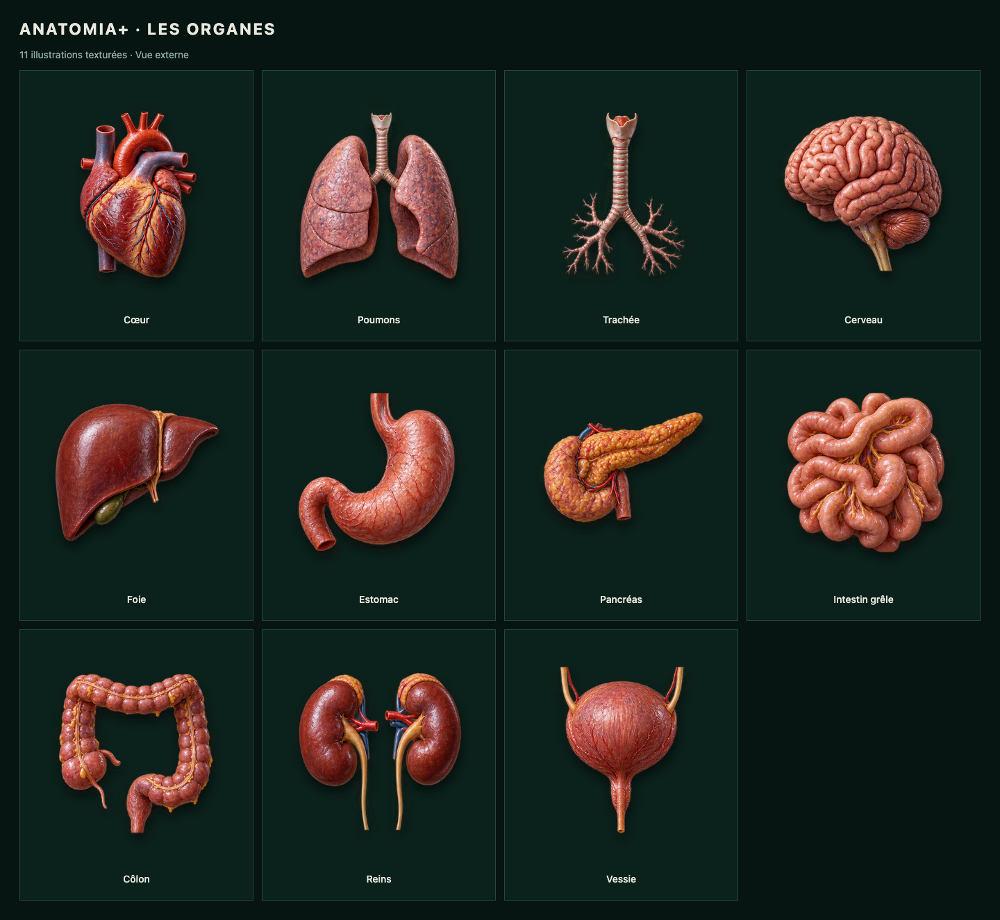

# ANATOMIA+

Un atlas interactif du corps humain pour explorer les principaux organes, leurs couches et leurs structures internes.


## Présentation

Anatomia+ propose une expérience pédagogique pseudo‑3D en français. L’utilisateur peut sélectionner un organe depuis une silhouette humaine, zoomer, simuler une rotation, afficher une coupe anatomique, révéler les réseaux et isoler une structure précise.

Le projet couvre actuellement :

- 5 systèmes anatomiques ;
- 11 organes principaux ;
- 110 structures documentées ;
- les noms français et latins ;
- le rôle, l’anatomie, les relations et des informations cliniques pédagogiques.

> Anatomia+ est un outil éducatif. Son contenu ne remplace pas un diagnostic ou un avis médical.

## Fonctionnalités

- Vue globale antérieure et postérieure du corps humain
- Navigation par système, organe et sous-structure
- Modes `Externe`, `Coupe`, `Réseaux` et `Isoler`
- 11 illustrations externes texturées : vaisseaux, reliefs, lobules, circonvolutions et fibres visibles
- Coupes explicatives propres à chaque organe et réseaux ramifiés
- Isolement visuel de la région sélectionnée, avec conservation du contexte
- Zoom, rotation simulée et réinitialisation de la caméra
- Repères anatomiques interactifs
- Repère actif toujours visible, avec liaison et accentuation dédiées
- Recherche en français ou en latin avec `⌘/Ctrl + K`
- Fiches détaillées avec trois niveaux de lecture
- URL partageable restaurant l’organe, la structure et le mode sélectionnés
- Interface responsive avec navigation mobile et fiche inférieure
- Navigation clavier et réduction des animations selon les préférences système

## Aperçus

| Bureau | Mobile |
| --- | --- |
|  |  |

## Technologies

- React 18
- TypeScript
- Vite
- SVG interactifs
- Lucide React
- Vitest et Testing Library
- Playwright pour les parcours de bout en bout

## Installation

Prérequis : Node.js 20 et pnpm.

```bash
pnpm install
pnpm dev
```

L’application est ensuite disponible sur [http://localhost:5173](http://localhost:5173).

## Vérification

```bash
pnpm test:run
pnpm build
```

Les scénarios de navigation complets peuvent être lancés avec :

```bash
pnpm exec playwright install chromium
pnpm test:e2e
```

## Structure du projet

```text
src/
├── components/   Interface et explorateur anatomique
├── data/         Contenu des systèmes, organes et structures
├── hooks/        État de navigation et de manipulation
├── lib/          Recherche et synchronisation avec l’URL
├── styles/       Direction artistique et responsive
└── types/        Modèle anatomique TypeScript
```

## Version prête à héberger

La commande `pnpm build` produit un site statique dans `dist/`. Une archive prête à héberger est également fournie dans [`outputs/anatomia-site.zip`](outputs/anatomia-site.zip).

## Illustrations détaillées



La vue externe utilise un atlas d’illustrations texturées partagé entre les onze organes. Le cœur en coupe conserve son illustration dédiée. Les autres coupes et les réseaux sont des schémas SVG, avec des détails spécifiques aux tissus : replis gastriques, pyramides rénales, arborisation bronchique et lobules pancréatiques. Les repères sont positionnés séparément selon la représentation. Sur mobile, la fiche reste sous la zone de visualisation.

L’atlas `src/assets/organ-atlas.png` a été généré par IA pour ce projet le 6 septembre 2026. Il s’agit d’illustrations pédagogiques, pas de reconstructions issues d’imagerie médicale ni de modèles anatomiques validés. Les repères internes en vue externe indiquent une région projetée. Le cadrage de chaque spécimen est défini dans `atlasLayout.ts`, sans recopier l’image pour chaque organe. L’atlas mesure 1086 × 1448 pixels ; ses détails matriciels ont une résolution finie au fort zoom. Les schémas restent vectoriels. La rotation reste une simulation sur une représentation 2D.
